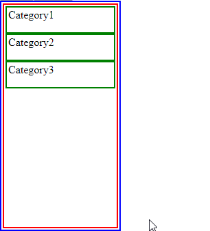
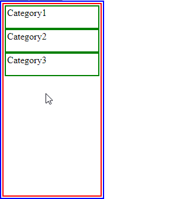
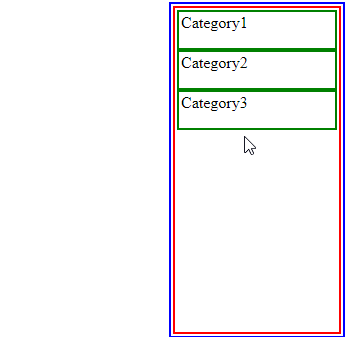
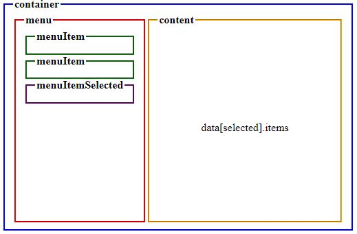

<p align="center"></p>

# react-mega-menu 
> A more natural feeling navigation menu component that can distinguish an option selection and an attempt to navigate to the submenu's content.

 
[![NPM Version][npm-image]][npm-url]
[![Downloads Stats][npm-downloads]][npm-url]

The component is used on Supply.com and styled as follows:


## Installation

```sh
npm install react-mega-menu --save
```

## Examples
The examples from this point on will be style-less except for borders and padding for presentation purposes. 



The menu is responsive, going up and down as expected, but when you attempt to point to the content container, it recognizes it and allows for a smooth transition without switching sections accidentally:

  

The menu can also present the content to the left instead of to the right:

 

## Usage

import the package   
```sh
import { ReactMegaMenu } from "react-mega-menu" //OR
import ReactMegaMenu from "react-mega-menu"
```

The component takes in a few props:
```
{
  tolerance?: number;
  direction?: Directions;
  data: Section[];
  styleConfig: StyleConfig;
  onExit?: () => void;
}
```
and can be used as follows:
```
...
<ReactMegaMenu 
  tolerance={50}      // optional, defaults to 100
  direction={"LEFT"}  // optional, defaults to "RIGHT", takes in "RIGHT" || "LEFT"
  styleConfig={...}   // defaults to an empty object. not recommended to be left blank.
  onExit={()=>{...}}  // a function to be called when a mouse leaves the container
  data={[...]}        // array of data to be rendered
/>
...
```

## Data Structure
Each element in the data array should consist of the following properties:
```
{
  label: string;            // label to be shown on for each menuItem
  key: string | number;     // a key id
  items: React.ReactNode;   // a react node to be presented as content
}
```
The labels will be presented in the menu and the appropriate items will be presented when the label gets hovered over.

## Styling
To style the component, please provide it with a `styleConfig` prop. This is highly recommended as the styling is close to nonexistent in this component. It is meant to be dynamic and easily fit into your web-app's style.

`styleConfig` prop consits of the following:
```
{
  containerProps?: React.HTMLAttributes<HTMLDivElement>;
  contentProps?: React.HTMLAttributes<HTMLDivElement>;
  menuItemProps?: React.HTMLAttributes<HTMLLIElement>;
  menuItemSelectedProps?: React.HTMLAttributes<HTMLLIElement>;
  menuProps?: React.HTMLAttributes<HTMLUListElement>;
}
```

It is recommended to create a `style`/`className` prop for each of those.
To better understand what each one of these affects, take a look at the following outline:    




## Development setup

1.  Clone repo: `git clone ...`
2.  run `npm install`
3.  run `npm start` to see a live demo

## Release History

* 1.0.0
  * initial release

## Meta

Baruch-Adi Hen – [@_baruchadi](https://twitter.com/_baruchadi) – b.hen@supply.com

Distributed under the MIT license. See ``LICENSE`` for more information.

[https://github.com/SUPPLYcom](https://github.com/SUPPLYcom)    
[https://github.com/baruchadi](https://github.com/baruchadi)


## Contributing

1. Fork it (<https://github.com/SUPPLYcom/react-mega-menu/fork>) 
2. Create your feature branch (`git checkout -b feature/fooBar`)
3. Commit your changes (`git commit -am 'Add some fooBar'`)
4. Push to the branch (`git push origin feature/fooBar`)
5. Create a new Pull Request

## Inspired by:
https://github.com/kamens/jQuery-menu-aim

<!-- Markdown link & img dfn's -->
[npm-image]: https://img.shields.io/npm/v/datadog-metrics.svg?style=flat-square
[npm-url]: https://www.npmjs.com/package/react-mega-menu
[npm-downloads]: https://img.shields.io/npm/dm/react-mega-menu.svg?style=flat-square
[supply]: https://www.supply.com/favicon.ico
